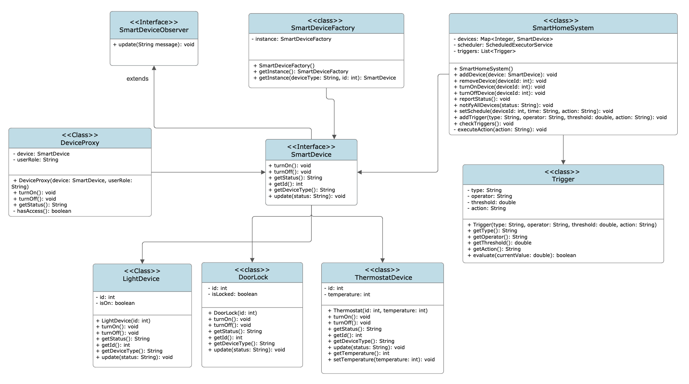
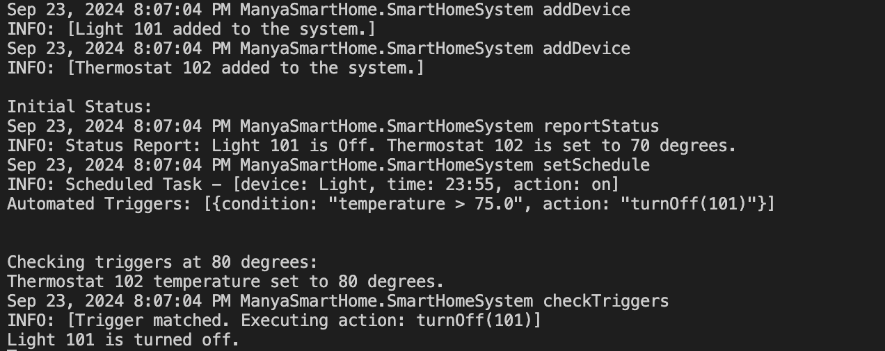

Smart Home System

Overview
The Smart Home System is a Java-based application designed to facilitate the management and automation of smart devices in a home environment. This system allows users to control devices such as lights, thermostats, and door locks efficiently, enhancing convenience and security.

Features
Device Management: Add, remove, and control smart devices.
Scheduling: Schedule actions to be performed at specific times.
Trigger Mechanism: Define environmental triggers to automate device actions based on conditions like temperature.
Access Control: Use a proxy pattern to enforce user permissions for device access.
Real-time Status Updates: Monitor the status of all devices in the system.

Key Components
SmartDeviceFactory: A singleton factory that creates instances of various smart devices.
SmartDevice Interface: Defines common operations for all smart devices.
Concrete Devices:
LightDevice: Represents a smart light.
Thermostat: Manages temperature settings.
DoorLock: Controls the locking mechanism.
SmartHomeSystem: The main system that manages devices, scheduling, and triggers.
Trigger: Represents conditions that automate device control.
DeviceProxy: Enforces access control based on user roles.

##UML Diagram

##Ouput Image

Prerequisites
JDK 8 or higher
An IDE (e.g., IntelliJ IDEA, Eclipse)

Important Classes
SmartHomeSystem: Manages device operations, scheduling, and triggers.
SmartDeviceFactory: Creates instances of smart devices.
DeviceProxy: Controls access to devices based on user roles.

Conclusion
The Smart Home System provides an innovative solution for automating and managing smart home devices. This project showcases the use of design patterns and principles to create a flexible and scalable application.